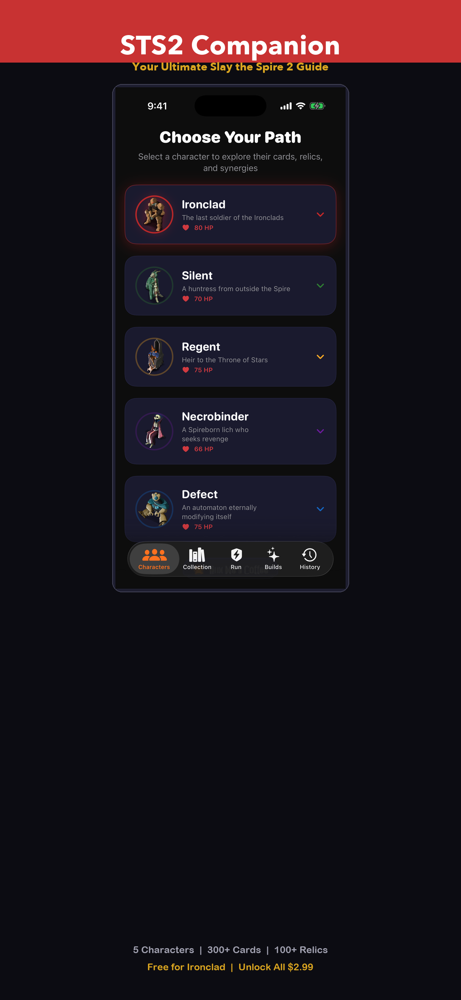
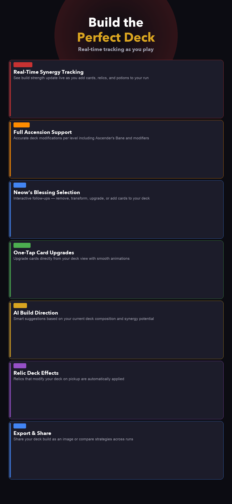
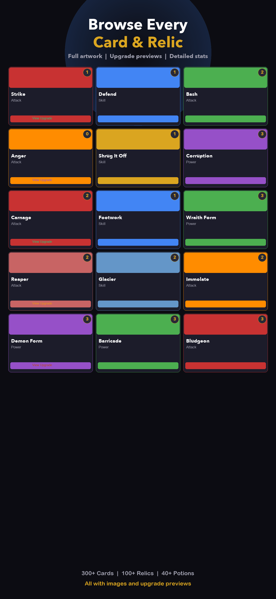
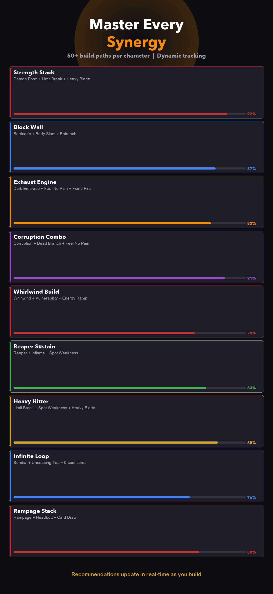
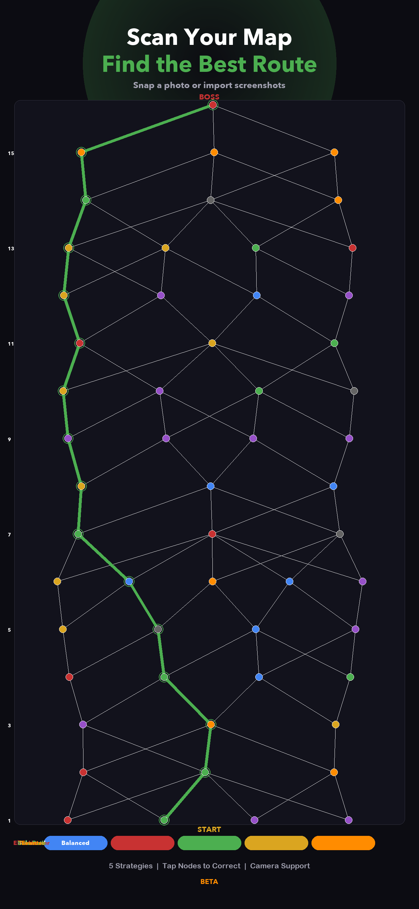
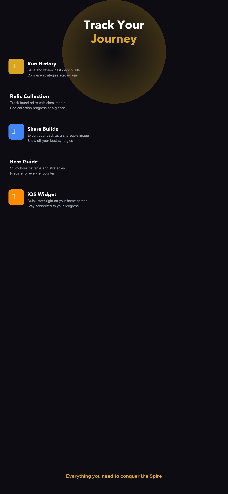

# Ascension Companion

A native iOS companion app for roguelike deck-building card games. Built with **SwiftUI**, **StoreKit 2**, and **Vision framework**.

> Available on the App Store (pending review).

---

## Screenshots

  
  
  

  
  
  

---

## Features

### Deck Builder
Build and tune decks with card counts, upgrades (CardName+), Neow's Blessing flows, and Ascension 0–10 — so your list matches how you actually play.

### Synergies & Builds
Explore character-specific synergy ideas and build directions as you add cards, relics, and potions. Spot strong paths before you commit.

### Card, Relic & Potion Browser
Flip through the full catalog with images, upgrade views, and detailed stats. Track relics you've found in your collection.

### Map Scanner (Beta)
Import or capture map screenshots and use Apple's **Vision framework** (OCR + image analysis) to sketch routes and plan optimal paths through each act.

### Run History
Save runs, revisit history, and share deck builds. Home screen widget keeps the app handy between floors.

---

## Tech Stack

| Layer | Technology |
|---|---|
| **UI** | SwiftUI, custom glass-card design system |
| **Payments** | StoreKit 2 (async/await, local testing config) |
| **Computer Vision** | Apple Vision framework (VNRecognizeTextRequest, contour detection) |
| **Data** | In-memory game database, UserDefaults persistence |
| **Architecture** | MVVM with @Observable / @EnvironmentObject |
| **Widget** | WidgetKit (home screen deck widget) |
| **Minimum Target** | iOS 17.0 |

---

## Architecture Highlights

- **StoreManager** — StoreKit 2 async purchase flow with retry logic, product load error handling, and transaction listener. No silent failures — every tap produces visible feedback (spinner, error, or purchase sheet).
- **MapVisionEngine** — Processes map screenshots through Vision framework OCR and contour detection to extract node positions and connections for route planning.
- **GameDataStore** — Central observable store managing selected character, deck state, saved runs, and relic collection with UserDefaults persistence.
- **DeckShareRenderer** — Renders shareable deck images with card counts, upgrades, and synergy tags for export.

---

## Pricing Model

- **Free tier** — Ironclad character + colorless cards, full browsing
- **One-time purchase ($2.99)** — Unlocks Silent, Regent, Necrobinder & Defect
- **Optional tip jar ($0.99)** — "Buy Me a Coffee" consumable

---

## Status

- [x] Core app complete
- [x] App Store submission (under review)
- [ ] Map Scanner improvements
- [ ] Additional synergy data

---

## Development Log

| Date | Update |
|---|---|
| **Apr 13, 2025** | Resubmitted to App Store — renamed to "Ascension Companion", fixed IAP sandbox issue (Paid Apps Agreement), improved purchase error handling. Awaiting approval. |
| **Apr 11, 2025** | First submission rejected (Guideline 4.1a name, 2.1b IAP). Diagnosed StoreKit config + missing banking setup. |
| **Apr 9, 2025** | Initial App Store submission — v1.0 build 1. |
| **Apr 8, 2025** | Core app complete — deck builder, synergy engine, card/relic/potion browser, map scanner beta, run history, widget. |

---

## Author

**Corey Crooks** — [GitHub](https://github.com/c3rooks)

---

*This is a portfolio showcase. Source code is private.*
